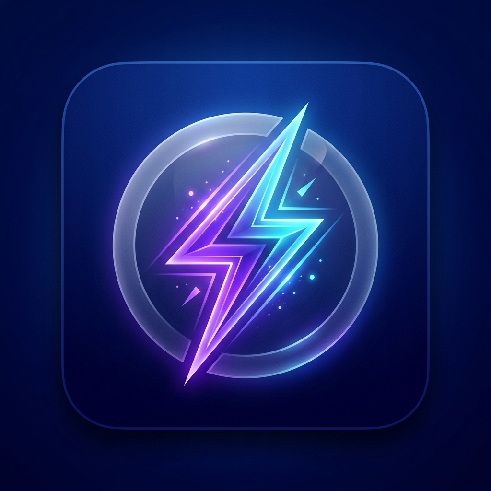

<div align="center">



# Prompter AI ✨

**AI-powered prompt engineering assistant — embedded directly inside your AI platforms**

[](https://github.com/rithwikkr0/prompter-ai)
[](https://developer.chrome.com/docs/extensions/mv3/intro/)
[](https://react.dev/)
[](LICENSE)
[](https://github.com/rithwikkr0/prompter-ai)

---

*Stop wasting time on bad prompts. One click transforms your rough ideas into precise, high-quality AI instructions — without ever leaving the page.*

</div>

---

## ✨ What Is Prompter AI?

Prompter AI is a **Chrome Extension (Manifest V3)** that places a floating ✨ button on every supported AI platform. Click it to instantly:

- **Enhance** your prompt with expert-level prompt engineering
- **Analyze** prompt quality with a 0–100 score + specific improvements
- **Rewrite** prompts for maximum clarity and effectiveness
- **Replace** the enhanced prompt back into the AI input with one click

The extension reads your visible conversation history for context-aware enhancement — and your API keys **never leave your browser**.

---

## 🌟 Features

| Feature | Description |
|---|---|
| **✨ Always-on Floating Widget** | ✨ button fixed in bottom-right on every supported page — survives SPA navigation |
| **🪟 Chrome Side Panel** | Full-featured side panel with quality ring, diff view, improvements list |
| **🔑 BYOK Multi-Provider** | Connect Gemini, OpenAI, Anthropic, Groq, or OpenRouter with your own keys |
| **🧠 Conversation Aware** | Reads visible chat history + title + attachments for smarter enhancement |
| **📊 Quality Scoring** | 0–100 quality ring with intent classification and missing context detection |
| **⟷ Diff View** | Word-level diff highlighting exactly what changed |
| **📋 Copy & Replace** | Insert enhanced prompt directly into the AI input |
| **💾 Enhancement History** | All enhancements saved locally with favorites and JSON export |
| **🗂️ Prompt Templates** | 12+ category templates — coding, writing, marketing, research, and more |
| **⌨️ Keyboard Shortcut** | `Ctrl+Shift+E` / `Cmd+Shift+E` to enhance from anywhere |
| **🖱️ Context Menu** | Right-click → Enhance / Rewrite / Analyze / Summarize |
| **🌙 Premium Dark UI** | Glassmorphism design with light/dark/system themes |
| **🔒 100% Local** | Zero cloud servers, no analytics, no accounts required |

---

## 🤖 Supported AI Platforms

| Platform | URL |
|---|---|
| 🔵 **Google Gemini** | `gemini.google.com` |
| 🟢 **ChatGPT** | `chat.openai.com` · `chatgpt.com` |
| 🟠 **Claude** | `claude.ai` |
| 🟣 **Perplexity** | `perplexity.ai` |
| 🔷 **Microsoft Copilot** | `copilot.microsoft.com` |
| 🐦 **Grok** | `grok.com` · `x.com` |

---

## 🔑 Supported AI Providers (BYOK)

| Provider | Models |
|---|---|
| **Google Gemini** | gemini-2.5-flash ⭐, gemini-2.5-pro, gemini-1.5-flash |
| **OpenAI** | gpt-4o-mini ⭐, gpt-4o, gpt-3.5-turbo |
| **Anthropic Claude** | claude-3-5-haiku ⭐, claude-3-5-sonnet, claude-3-opus |
| **Groq Cloud** | llama-3.3-70b ⭐, llama-3.1-8b, mixtral-8x7b |
| **OpenRouter** | 100+ models via a single key |

> ⭐ = Recommended model · All providers offer free tiers

---

## 🚀 Quick Install

### Option A — Load from Source (Recommended)

```bash
# 1. Clone the repository
git clone https://github.com/rithwikkr0/prompter-ai.git
cd prompter-ai

# 2. Install dependencies
npm install

# 3. Build the extension
npm run build
```

Then:
1. Open **Chrome** → `chrome://extensions/`
2. Enable **Developer Mode** (toggle top-right)
3. Click **"Load unpacked"**
4. Select the **`extension/`** folder from this project

> ✅ The Prompter AI icon will appear in your Chrome toolbar!

### Option B — Download ZIP

> **[⬇️ Download Latest Release](https://github.com/rithwikkr0/prompter-ai/releases/latest)**

1. Download and unzip `prompter-ai-vX.X.X.zip`
2. Open `chrome://extensions/` → Enable **Developer Mode**
3. Click **"Load unpacked"** → select the unzipped folder

---

## ⚙️ First-Time Setup

### Step 1 — Open the Extension
Click the **Prompter AI icon** in the Chrome toolbar. It will open the **Side Panel** on the right side of your browser.

### Step 2 — Configure an API Key
Navigate to **Settings → API Configuration** and enter your key for at least one provider:

| Provider | Get Your Free Key |
|---|---|
| Google Gemini | [aistudio.google.com/app/apikey](https://aistudio.google.com/app/apikey) |
| OpenAI | [platform.openai.com/api-keys](https://platform.openai.com/api-keys) |
| Anthropic | [console.anthropic.com/settings/keys](https://console.anthropic.com/settings/keys) |
| Groq (Ultra Fast) | [console.groq.com/keys](https://console.groq.com/keys) |
| OpenRouter | [openrouter.ai/keys](https://openrouter.ai/keys) |

### Step 3 — Use It!
Navigate to any supported AI site. The **✨ widget** appears automatically in the bottom-right corner.

---

## 🎯 How to Use

### Method 1: Floating Widget
1. Go to Gemini, ChatGPT, Claude, etc.
2. Type your prompt in the input box
3. Click the **✨ button** (bottom-right corner)
4. Review results in the **Side Panel** → click **"→ Replace Prompt"**

### Method 2: Right-Click Menu
1. Select text in any AI input box
2. Right-click → choose:
   - **✨ Enhance Prompt** — Full AI prompt engineering
   - **🔄 Rewrite Prompt** — Rewrite for clarity
   - **🔍 Analyze Prompt Quality** — Score and suggestions
   - **📝 Summarize for AI** — Concise AI-friendly version

### Method 3: Keyboard Shortcut
- Press `Ctrl+Shift+E` (Windows/Linux) or `Cmd+Shift+E` (Mac)

### Method 4: Side Panel Actions
In the open Side Panel:
- **⟷ Diff View** — See word-level changes
- **📋 Copy** — Copy the enhanced prompt
- **→ Replace** — Insert directly into the AI input
- **⟳ Improve Again** — Iterate on the enhanced prompt
- **⬇️ Export JSON** — Download the full analysis

---

## ⌨️ Keyboard Shortcuts

| Shortcut | Action |
|---|---|
| `Ctrl+Shift+E` | Enhance current prompt |
| `Cmd+Shift+E` | Enhance (Mac) |

**Customize:** `chrome://extensions/shortcuts`

---

## 🛠️ Developer Setup

```bash
git clone https://github.com/rithwikkr0/prompter-ai.git
cd prompter-ai

npm install          # Install dependencies
npm run dev          # Dev server → http://localhost:5173/
npm run build        # Production build → extension/
npm run lint         # TypeScript + ESLint check
```

### Project Structure

```
prompter-ai/
├── extension/           # ← Load this in chrome://extensions
│   ├── manifest.json    # MV3 manifest
│   ├── background.js    # Service worker (API relay, history, badge)
│   ├── content.js       # Injected into AI platforms (widget + panel)
│   ├── popup.html       # Side panel & popup entry point
│   ├── icons/           # Icon set (16, 32, 48, 128px)
│   └── assets/          # Compiled React app (JS + CSS)
├── src/                 # React + TypeScript source
│   ├── pages/           # Dashboard, History, Templates, Settings, About
│   ├── components/      # Layout, ResultsPanel, TemplateBrowser, etc.
│   ├── ai/gemini.ts     # Multi-provider AI client
│   ├── storage/         # chrome.storage / localStorage abstraction
│   └── types/           # Zod schemas + TypeScript types
├── scripts/
│   └── copy-assets.js   # Post-build: copies dist/ → extension/assets/
├── PRIVACY_POLICY.md    # Privacy policy (Chrome Web Store)
├── TERMS_OF_USE.md      # Terms of use
└── vite.config.ts       # Vite build configuration
```

---

## 🔒 Privacy & Security

| Aspect | Detail |
|---|---|
| **API Keys** | Stored in `chrome.storage.local` — never sent to Prompter AI servers |
| **Prompt Data** | Sent directly from your browser to your chosen AI provider only |
| **History** | Stored locally in Chrome storage, never uploaded |
| **Analytics** | None. Zero telemetry. |
| **Accounts** | Not required. No sign-up. |
| **Open Source** | Fully auditable at this repository |

Full details: [PRIVACY_POLICY.md](PRIVACY_POLICY.md) · [TERMS_OF_USE.md](TERMS_OF_USE.md)

---

## 🏗️ Tech Stack

| Layer | Technology |
|---|---|
| **Framework** | React 19 + TypeScript + Vite 8 |
| **Styling** | Vanilla CSS + Glassmorphism (no Tailwind in extension) |
| **Animations** | Framer Motion 12 |
| **Schema Validation** | Zod 4 |
| **Routing** | React Router v7 (HashRouter) |
| **Extension** | Chrome Manifest V3 |
| **AI Providers** | Gemini, OpenAI, Anthropic, Groq, OpenRouter |

---

## 📋 Changelog

### v1.0.0 — July 2026 (Google Builder Series 2026)

**New Features:**
- ✅ Always-on floating widget at bottom-right — survives SPA navigation
- ✅ Chrome Side Panel integration with full analysis view
- ✅ BYOK multi-provider support (Gemini, OpenAI, Anthropic, Groq, OpenRouter)
- ✅ Conversation-aware enhancement (reads visible chat history + title + attachments)
- ✅ Word-level diff view with green highlighting
- ✅ 0–100 quality score ring with intent classification
- ✅ Prompt history with favorites, search, and JSON export
- ✅ 12+ prompt template categories
- ✅ HashRouter-based navigation (works in extension + side panel)
- ✅ Friendly error messages for all failure scenarios (offline, invalid key, quota exceeded)
- ✅ Keyboard shortcut + right-click context menu
- ✅ History API hooks for SPA navigation tracking (pushState/replaceState/popstate)

---

## 🤝 Contributing

Pull requests are welcome!

```bash
git checkout -b feature/my-feature
git commit -m "feat: add my feature"
git push origin feature/my-feature
# Open a Pull Request on GitHub
```

---

## 📄 License

MIT — see [LICENSE](LICENSE)

---

<div align="center">
  <strong>Built for Google Builder Series 2026</strong><br/>
  Made with ✨ by <a href="https://github.com/rithwikkr0">@rithwikkr0</a>
</div>
