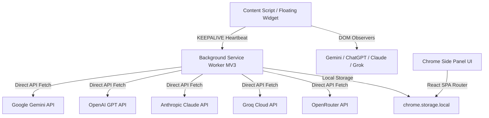

# ⚡ Prompter AI v2.1 — Intelligent Prompt Engineering Assistant

[](https://developer.chrome.com/docs/extensions/mv3/intro/)
[](CHANGELOG.md)
[](LICENSE)
[](#-google-builder-series-2026)

**Prompter AI** is a premium, context-aware Chrome Extension and AI prompt engineering assistant that lives natively inside **Google Gemini**, **ChatGPT**, **Claude**, **Perplexity**, **Microsoft Copilot**, and **Grok**.

---

## 🌟 Key Features

- 🧠 **AI Prompt Memory (Personal Prompt Engineer)**: Remembers your preferred programming language, framework, tone, response length, and custom system rules locally across all sessions.
- 💬 **Conversation Awareness 2.0**: Reads visible message turns, title, and file chips across 6 AI platforms with 4 context modes (`Prompt Only`, `Current Chat`, `Full Conversation`, `Manual`).
- 🎯 **Intelligent Prompt Interview**: Automatically calculates prompt quality (0–100 score + 5-axis breakdown). If score `< 90`, launches a 2–3 question Claude-style dynamic interview with `⭐ AI Recommended` badges.
- 📊 **Multi-Model Benchmark Mode**: Generates side-by-side prompt variations optimized specifically for **Google Gemini**, **Anthropic Claude XML**, and **OpenAI ChatGPT**.
- 🛠️ **GitHub-Style Prompt Diff**: Highlights added and deleted text side-by-side or unified with syntax formatting.
- 🎓 **Prompt Coach**: Teaches prompt engineering skills with checkmarked learning points (`✓ Added role definition`, `✓ Established output format`).
- 🔍 **Search Everywhere Command Palette (`Ctrl+K`)**: VS Code style global search across History, Templates, Favorites, Analytics, Memory, and Settings.
- 🛡️ **Prompt Safety Check**: Real-time Regex scanner detecting API keys (`sk-...`, `AIza...`), passwords, and access tokens before dispatching API calls.
- 🚀 **Smart Provider Fallback**: Automatically offers secondary configured provider retries if an API quota or rate limit is reached.

---

## 🏗️ Architecture Sitemap


```mermaid
graph TD
    A[Content Script / Floating Widget] -->|KEEPALIVE Heartbeat| B[Background Service Worker MV3]
    A -->|DOM Observers| C[Gemini / ChatGPT / Claude / Grok]
    B -->|Direct API Fetch| D[Google Gemini API]
    B -->|Direct API Fetch| E[OpenAI GPT API]
    B -->|Direct API Fetch| F[Anthropic Claude API]
    B -->|Direct API Fetch| G[Groq Cloud API]
    B -->|Direct API Fetch| H[OpenRouter API]
    B -->|Local Storage| I[chrome.storage.local]
    J[Chrome Side Panel UI] -->|React SPA Router| I
```

---

## 💻 Supported AI Platforms

| Platform | Domain | Supported Features |
| :--- | :--- | :--- |
| **Google Gemini** | `gemini.google.com` | Full Widget, Context Extraction, Side Panel |
| **ChatGPT** | `chatgpt.com` / `chat.openai.com` | Full Widget, Context Extraction, Side Panel |
| **Claude** | `claude.ai` | Full Widget, XML Tag Optimization, Side Panel |
| **Perplexity** | `perplexity.ai` | Full Widget, Context Extraction, Side Panel |
| **Microsoft Copilot** | `copilot.microsoft.com` | Full Widget, Side Panel |
| **xAI Grok** | `grok.com` / `x.com` | Full Widget, Side Panel |

---

## 🚀 Quick Start & Installation

1. Clone or download this repository:
   ```bash
   git clone https://github.com/rithwikkr0/prompter-ai.git
   ```
2. Build the production extension package:
   ```bash
   npm install
   npm run build
   ```
3. Open Google Chrome and navigate to `chrome://extensions/`.
4. Enable **Developer mode** in the top-right corner.
5. Click **Load unpacked** and select the `extension/` directory.

---

## 📄 License & Credits

Created by **Rithwik KR** for the **Google Builder Series 2026**.  
Distributed under the **MIT License**.
