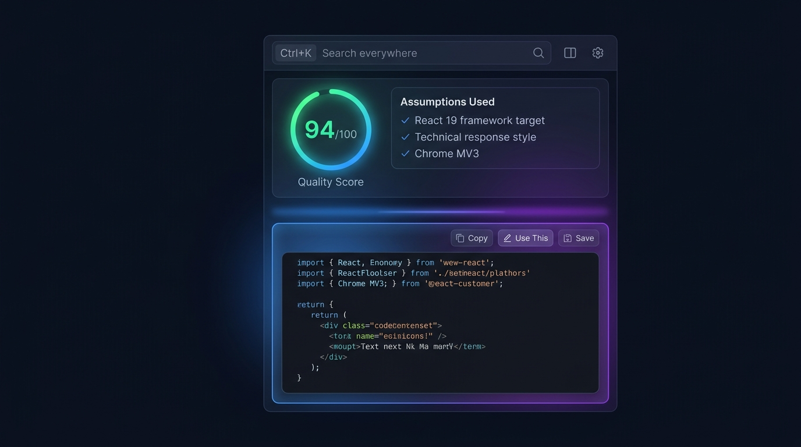
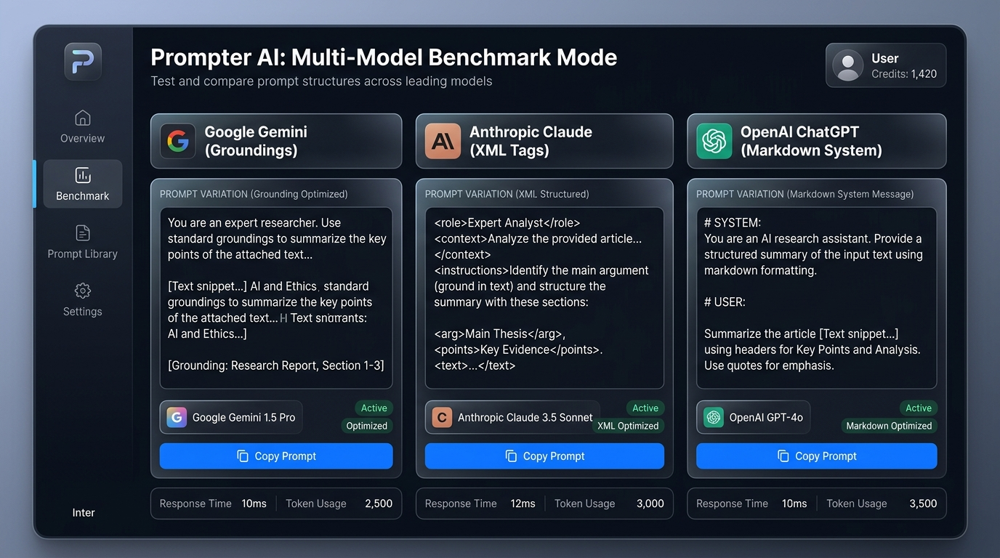
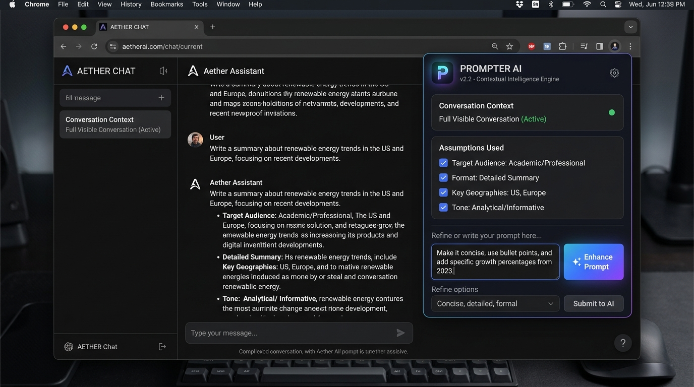
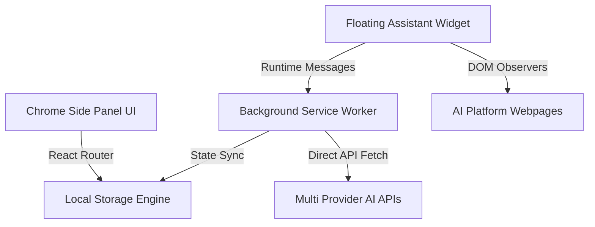
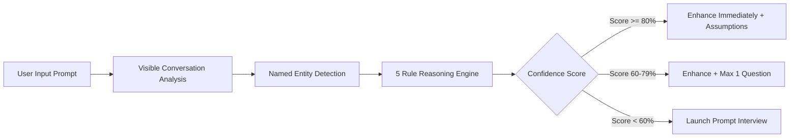
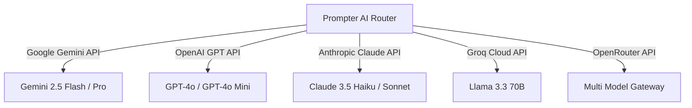
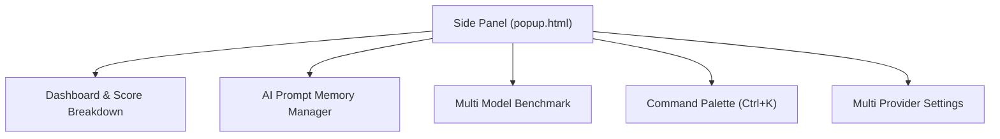

# ⚡ Prompter AI v2.2 — Contextual Intelligence Engine

[](https://developer.chrome.com/docs/extensions/mv3/intro/)
[](CHANGELOG.md)
[](LICENSE)
[](#-quick-start--installation-guide)

**Prompter AI** is an intelligent, context-aware Chrome Extension and AI prompt engineering assistant that lives natively inside **Google Gemini**, **ChatGPT**, **Claude**, **Perplexity**, **Microsoft Copilot**, and **xAI Grok**.

Driven by the **v2.2 Contextual Intelligence Engine**, Prompter AI reasons like an experienced senior AI assistant before asking questions—maximizing intelligent assumptions, recognizing technical entities, and eliminating unnecessary interruptions.

---

## 📸 Screenshots & Product Gallery

| Dashboard & Score Analysis | Multi-Model Benchmark Mode | Floating Assistant Widget |
| :---: | :---: | :---: |
|  |  |  |

---

## 🌟 Key Features

### 🧠 1. Contextual Intelligence Engine (v2.2)
- **Named Entity Recognition (NER)**: Detects technical terms, tools, libraries, frameworks, and AI systems (e.g. *Prompter AI*, *Antigravity*, *React*, *Gemini*, *Chrome Extension*, *VS Code*, *LangGraph*, *Groq*, *Claude*). Never asks redundant questions like *"What is Antigravity?"*.
- **Reasoning Before Asking**: Evaluates 5 core rules before interrupting:
  1. *Inferable from visible conversation?* → Do not ask.
  2. *Inferable from AI Prompt Memory?* → Do not ask.
  3. *Can safely assume?* → Make assumption & state it. Do not ask.
  4. *Will question significantly improve result?* → Do not ask.
  5. *User already answered?* → Do not ask again.
- **Confidence-Based Decision Engine**:
  - `Confidence ≥ 80%`: Enhances immediately with intelligent assumptions.
  - `Confidence 60–79%`: Enhances immediately; max 1 clarification question if essential.
  - `Confidence < 60%`: Triggers interactive interview with 2–3 targeted questions.
- **Assumptions Transparency**: Displays an **"Assumptions Used"** checklist (e.g. `✓ React 19 framework target`, `✓ Chrome MV3 environment`, `✓ Technical response format`) so you understand every decision made.

### 🧠 2. AI Prompt Memory (Personal Prompt Engineer)
Remembers your preferred programming language, tech stack, response length, output format, writing tone, and custom rules locally across sessions.

### 💬 3. Conversation Awareness 2.0
Reads visible message turns, chat titles, and file chips across 6 AI platforms with 4 context modes (`Prompt Only`, `Current Chat`, `Full Conversation`, `Manual Context`).

### 📊 4. Multi-Model Benchmark Mode
Generates side-by-side prompt variations optimized specifically for **Google Gemini** (groundings), **Anthropic Claude** (XML tags), and **OpenAI ChatGPT** (system markdown framing).

### 🛠️ 5. GitHub-Style Prompt Diff & Coach
Highlights added and deleted prompt text side-by-side or unified, while explaining prompt engineering best practices applied (`✓ Added role framing`, `✓ Specified output structure`).

### 🔍 6. Search Everywhere Command Palette (`Ctrl+K`)
VS Code style command palette for lightning-fast search across History, Templates, Favorites, Analytics, AI Memory, Settings, and Help Docs.

### 🛡️ 7. Security Scanner & Smart Provider Fallback
- **Safety Scanner**: Real-time Regex scanner detecting API keys (`sk-...`, `AIza...`), passwords, and access tokens before dispatching API calls.
- **Smart Fallback**: Automatically offers single-click secondary provider retries if an API rate limit or error occurs.

---

## 🏗️ Architecture & Component Diagrams

### 1. System Architecture


```mermaid
flowchart TD
    UI["Chrome Side Panel UI"] -->|React Router| Store["Local Storage Engine"]
    Widget["Floating Assistant Widget"] -->|DOM Observers| Host["AI Platform Webpages"]
    Widget -->|Runtime Messages| Worker["Background Service Worker"]
    Worker -->|Direct API Fetch| Providers["Multi Provider AI APIs"]
    Worker -->|State Sync| Store
```

### 2. Contextual Intelligence Pipeline (v2.2)


```mermaid
flowchart LR
    Prompt["User Input Prompt"] --> Context["Visible Conversation Analysis"]
    Context --> NER["Named Entity Detection"]
    NER --> Rules["5 Rule Reasoning Engine"]
    Rules --> Conf{"Confidence Score"}
    Conf -->|Score >= 80%| Direct["Enhance Immediately + Assumptions"]
    Conf -->|Score 60-79%| MaxOne["Enhance + Max 1 Question"]
    Conf -->|Score < 60%| Interview["Launch Prompt Interview"]
```

### 3. AI Provider Routing Architecture


```mermaid
flowchart TD
    Engine["Prompter AI Router"] -->|Google Gemini API| Gemini["Gemini 2.5 Flash / Pro"]
    Engine -->|OpenAI GPT API| OpenAI["GPT-4o / GPT-4o Mini"]
    Engine -->|Anthropic Claude API| Claude["Claude 3.5 Haiku / Sonnet"]
    Engine -->|Groq Cloud API| Groq["Llama 3.3 70B"]
    Engine -->|OpenRouter API| OpenRouter["Multi Model Gateway"]
```

### 4. Chrome Extension Components


```mermaid
flowchart TD
    Panel["Side Panel (popup.html)"] --> Dash["Dashboard & Score Breakdown"]
    Panel --> Mem["AI Prompt Memory Manager"]
    Panel --> Bench["Multi Model Benchmark"]
    Panel --> Palette["Command Palette (Ctrl+K)"]
    Panel --> Settings["Multi Provider Settings"]
```

---

## 💻 Supported AI Platforms

| Platform | Domain | Integration Level |
| :--- | :--- | :--- |
| **Google Gemini** | `gemini.google.com` | Native Widget + Context Extraction + Side Panel |
| **ChatGPT** | `chatgpt.com` / `chat.openai.com` | Native Widget + Context Extraction + Side Panel |
| **Claude** | `claude.ai` | Native Widget + XML Tag Optimization + Side Panel |
| **Perplexity** | `perplexity.ai` | Native Widget + Context Extraction + Side Panel |
| **Microsoft Copilot** | `copilot.microsoft.com` | Native Widget + Side Panel |
| **xAI Grok** | `grok.com` / `x.com` | Native Widget + Side Panel |

---

## 🚀 Quick Start & Installation Guide

### Option A: Install from Zip Package (Recommended)

1. Download the latest release package:  
   📂 [`release/Prompter-AI-v2.0.0.zip`](release/Prompter-AI-v2.0.0.zip)
2. Extract the ZIP archive to a folder on your computer.
3. Open **Google Chrome** and navigate to `chrome://extensions/`.
4. Enable **Developer mode** toggle in the top-right corner.
5. Click **Load unpacked** and select the extracted `extension/` folder.
6. Open any AI platform (e.g. [gemini.google.com](https://gemini.google.com)) to start using Prompter AI!

---

### Option B: Build from Source Code

1. **Clone the repository**:
   ```bash
   git clone https://github.com/rithwikkr0/prompter-ai.git
   cd prompter-ai
   ```

2. **Install dependencies**:
   ```bash
   npm install
   ```

3. **Compile the extension**:
   ```bash
   npm run build
   ```

4. **Load into Chrome**:
   - Go to `chrome://extensions/`
   - Enable **Developer mode**
   - Click **Load unpacked** → select `extension/` directory

---

## ⌨️ Keyboard Shortcuts

| Shortcut | Scope | Action |
| :--- | :--- | :--- |
| `Ctrl+Shift+E` (or `⌘+Shift+E`) | Any AI Input Box | Enhance current prompt text immediately |
| `Ctrl+K` (or `⌘+K`) | Side Panel / Popup | Open Search Everywhere Command Palette |
| `Right-Click` → Context Menu | Selected Text | Enhance, Rewrite, Analyze, or Summarize for AI |

---

## 👨‍💻 Author & License

- **Author**: Created by **Rithwik KR**
- **License**: Distributed under the **MIT License**. See [`LICENSE`](LICENSE) for details.
- **Repository**: [https://github.com/rithwikkr0/prompter-ai](https://github.com/rithwikkr0/prompter-ai)
